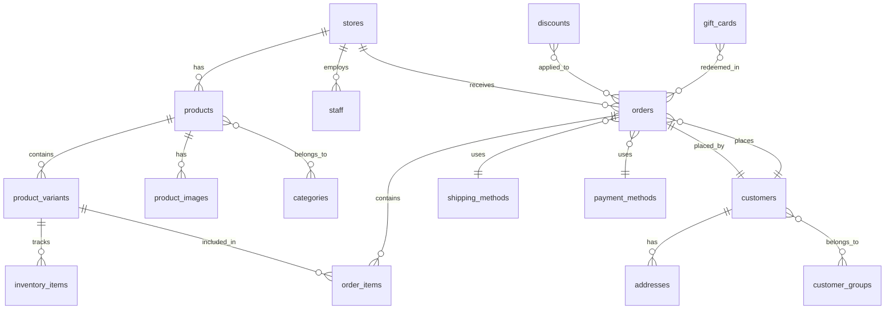
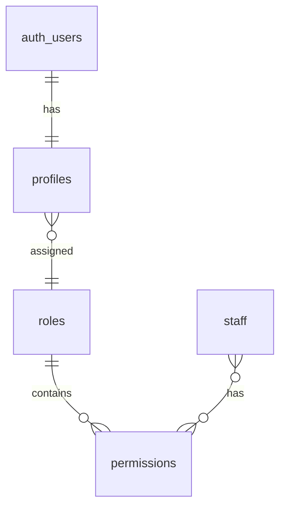
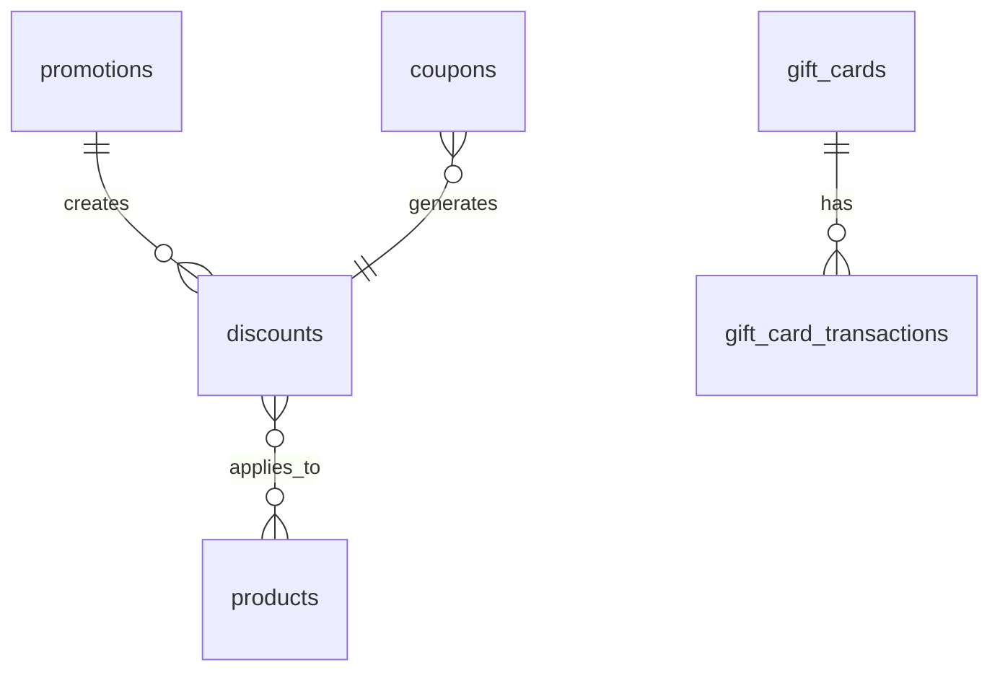

# Database Schema Diagram

## Overview

This document provides a visual representation of our database schema using Mermaid diagrams.

## Core Schema

## Authentication Schema

## Marketing Schema

## Table Details

For detailed information about each table, including columns and constraints, see:
- [Table Definitions](./tables.md)
- [Relationships](./relationships.md)

## Notes

- All tables include created_at and updated_at timestamps
- Foreign keys use appropriate ON DELETE rules
- Tables implement Row Level Security
- Proper indexing on frequently queried columns
