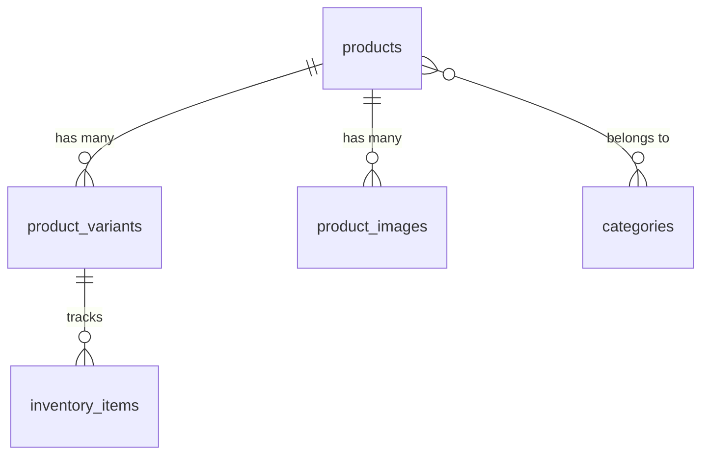
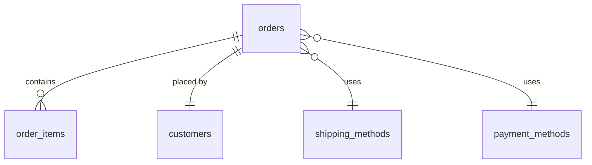
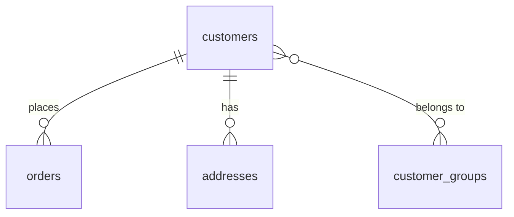

# Database Relationships

## Overview

This document outlines the relationships between tables in our database, including foreign key constraints and their purposes.

## Core Relationships

### Store Management


### Product Management


### Order Processing


### Customer Management


## Relationship Details

### Foreign Key Constraints

#### Products Table
```sql
ALTER TABLE products
    ADD CONSTRAINT fk_store
    FOREIGN KEY (store_id)
    REFERENCES stores(id)
    ON DELETE CASCADE;
```

[Additional constraints from ../migrations/initial-schema.sql...]

## Data Integrity

### Cascade Rules
- Product deletion cascades to variants and images
- Store deletion cascades to products and inventory
- Order deletion cascades to order items

### Constraints
- Prevent orphaned records
- Maintain referential integrity
- Enforce business rules

## Performance Considerations

### Indexing Strategy
- Foreign key columns are indexed
- Frequently joined columns have appropriate indexes
- Composite indexes for common queries

### Query Optimization
- Join order considerations
- Index usage in complex queries
- Performance impact of cascading deletes
